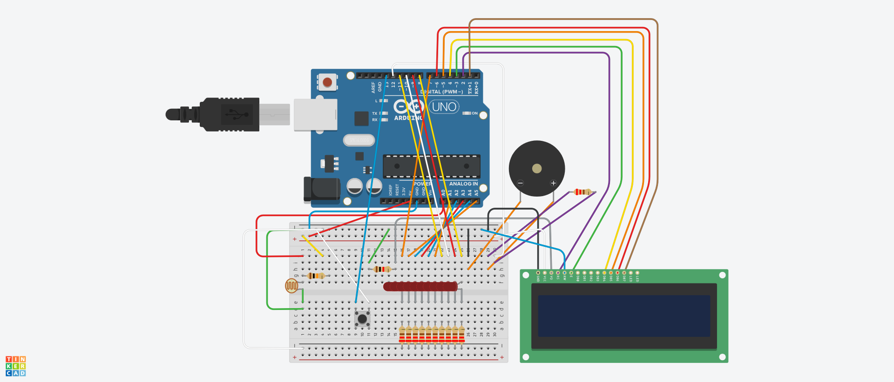
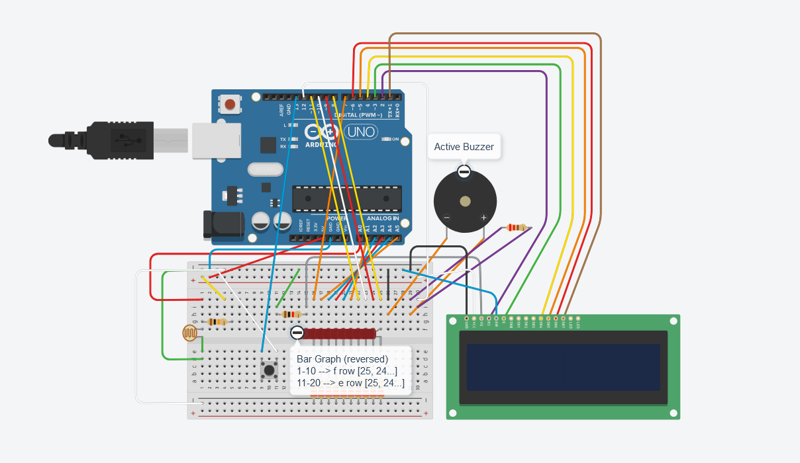

# Signalny system s fotorezistorom

## Kratky popis
Projekt predstavuje jednoduchy signalny system zalozeny na Arduino:
- Fotorezistor meria uroveň svetla
- Na LCD displeji sa zobrazuje aktualny uroven svetla a Alarm Status (300 = tma, 1000 = velmi svetlo)
- Bar Graph vizualne ukazuje, ako velmi je svetlo alebo tma
- Tlacidlo prepina rezimy: OFF (alarm vypnuty) a AWAY (alarm zapnuty)
- Pri prechode na AWAY bude 5 sekund, aby clovek mohol odist (na LCD je odpocitavanie, kazdu sekundu buzzer robi zvukovy signal "pip")
- Ak je AWAY a bude velmi svetlo, system spusti 5 sek odklad. Pocas odkladu (odpocitanie 5, 4, 3...) moze pouzivatel stlacit tlacidlo a vypnut alarm. Ak nie, po 5 sekund sa spusti buzzer (Alarm)
- Alarm sa vypne, ked sa status alarmu opat prepne na OFF

## Pouzite moduly
- Fotorezistor
- Rezistor 10 kOhm
- LCD displej (16x2)
- Bar Graph
- Tlacidlo (Push Button)
- Active buzzer
- Arduino (podobny mikrokontroler)

## Schema zapojenia

from Tinkercad

## Ako to funguje
1. Fotorezistor meria uroveň osvetlenia.
2. Arduino spracuje hodnotu a zobrazi ju na LCD displeji (hodnota medzi 300 a 1000)
3. Bar Graph ukazuje uroveň svetla: pri nizkom osvetleni svieti menej LED, pri vyššom svietia všetky
4. Stlačenim tlacidla prepiname medzi režimami:
   - OFF: Alarm je vypnuty
   - AWAY: Ak sa svetlo nahle zmeni (napr. zapnutie svetla), aktivuje sa bzuciak (po 5 sekundach, ak nebude vypnuty za tuto dobu)
5. LCD displej zaroven ukazuje aktualny stav režimu: OFF alebo AWAY

## Vyhody
- Možnost sledovania urovne svetla v realnom case
- Jednoduche ovladanie cez tlacidlo
- Displej a LED stlpec poskytuju presny a vizualny prehlad
- Lacne riesenie
- Moznost vylepsenia a rozsireenia

## Nevyhody
- System vyzaduje stale napajanie
- Nebude efektivny v uplnej tme
- Buzzer nedostatocne hlasny (mozno riesit. priklad: pomocou pripojenia systemu k mobilnej aplikacie pre odosielanie sprav)
- LCD displej je tazko citatelny (mozno riesit pomocou viac "konektorov" a vacsim "board"-om)
